# 🚀 LangChain Learning Hub

A hands-on learning project built with **LangChain** and **Groq (free LLM API)**
that teaches every major LangChain concept through 5 progressive use cases —
all tied together with Python's famous `import antigravity` Easter egg.

---

## 📋 Table of Contents

- [What is LangChain?](#what-is-langchain)
- [Why LangChain?](#why-langchain)
- [LangChain Architecture](#langchain-architecture)
- [Core Concepts](#core-concepts)
- [Project Structure](#project-structure)
- [Setup and Installation](#setup-and-installation)
- [Use Cases](#use-cases)
  - [Use Case 1 — Simple Chain](#use-case-1--simple-chain)
  - [Use Case 2 — Conversation with Memory](#use-case-2--conversation-with-memory)
  - [Use Case 3 — RAG Pipeline](#use-case-3--rag-pipeline)
  - [Use Case 4 — Tools and Agents](#use-case-4--tools-and-agents)
  - [Use Case 5 — Streaming and Structured Output](#use-case-5--streaming-and-structured-output)
- [How to Run](#how-to-run)
- [Tech Stack](#tech-stack)
- [Key Learnings](#key-learnings)

---

## What is LangChain?

**LangChain** is an open-source framework for building applications powered by
Large Language Models (LLMs).

A raw LLM (like GPT-4, Llama 3, or Gemini) is essentially a function —
it takes text in and returns text out. That is powerful on its own, but it
cannot remember previous conversations, search your documents, call APIs,
or decide what action to take next. LangChain solves all of that.

```
Raw LLM   =  an engine sitting on a workbench
LangChain =  the full car — steering, GPS, brakes, and fuel system included
```

LangChain lets you connect LLMs to:

- **Your own data** — PDFs, text files, databases, websites
- **Memory** — so the LLM remembers what you said earlier
- **Tools** — calculators, search engines, APIs, custom Python functions
- **Other LLMs** — chain multiple models together
- **Structured output** — force the LLM to return valid JSON

---

## Why LangChain?

### Without LangChain

Every time you build an LLM feature you manually:
- Construct prompt strings with f-strings
- Parse the response text yourself
- Manage conversation history in a list and inject it into every request
- Write retry logic for API failures
- Build your own document search system from scratch
- Handle tool calling, output validation, and error recovery yourself

### With LangChain

```python
# A complete conversational RAG pipeline in a few lines
chain = prompt | llm | parser
result = chain.invoke({"topic": "Python", "style": "fun"})
```

| Problem | LangChain Solution |
|---|---|
| Prompt management | `ChatPromptTemplate` with typed variables |
| Model swapping | One-line change, same interface everywhere |
| Conversation history | `ConversationBufferMemory` — automatic |
| Document search | `FAISS` + `TextLoader` + `TextSplitter` |
| Tool calling | `@tool` decorator + `AgentExecutor` |
| Streaming | `.stream()` method on any chain |
| Structured output | `JsonOutputParser` |
| Composability | LCEL `\|` pipe operator |

---

## LangChain Architecture

### Overall Framework Architecture

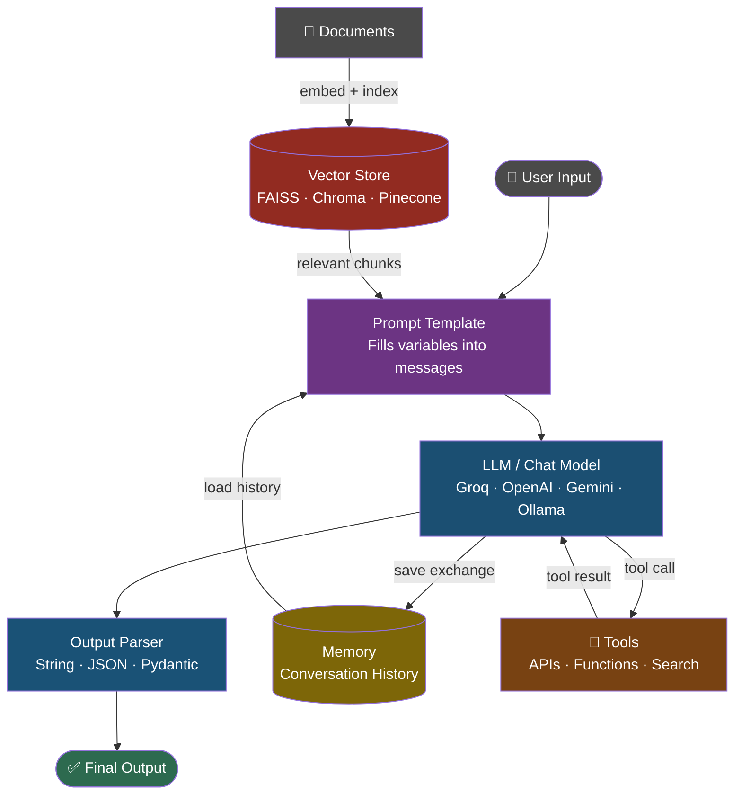

### LCEL — How the Pipe Operator Works

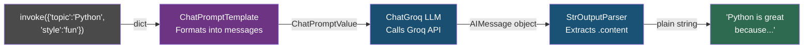

---

## Core Concepts

### 1. Prompt Template

```python
prompt = ChatPromptTemplate.from_messages([
    ("system", "You are a helpful assistant."),
    ("human",  "Explain {topic} in a {style} way."),
])
```

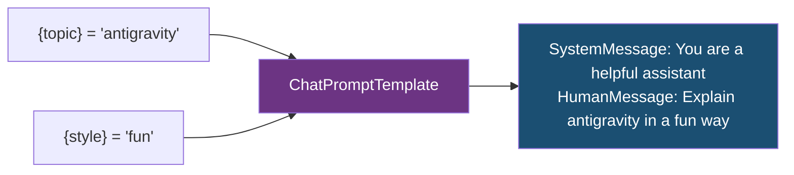

Without templates you concatenate strings manually everywhere.
Templates make prompts testable, versionable, and reusable across your entire app.

### 2. LLM / Chat Model

```python
from langchain_groq import ChatGroq
llm = ChatGroq(model="llama3-8b-8192", temperature=0.7)
```

`temperature` controls randomness:
- `0.0` = deterministic, factual answers
- `0.7` = balanced — default for most tasks
- `1.0` = creative, varied output

LangChain supports every major provider through the same interface.
Swap `ChatGroq` for `ChatOpenAI` or `ChatAnthropic` — nothing else changes.

### 3. Memory Types

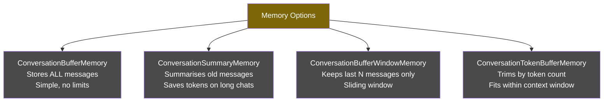

### 4. RAG — Retrieval Augmented Generation

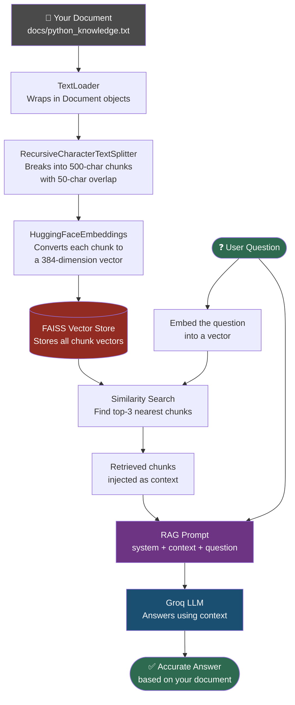

### 5. Agents — ReAct Loop

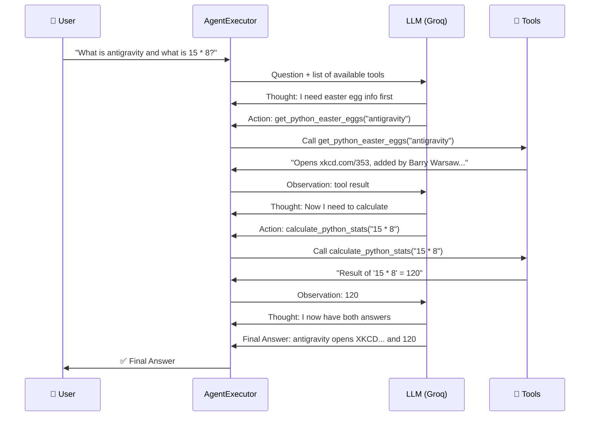

---

## Project Structure

```
langchain_learning_hub/
│
├── .env                           # Your API key (never commit this)
├── .env.example                   # Template for others to copy
├── .gitignore                     # Excludes venv/, .env, __pycache__
├── requirements.txt               # All dependencies with versions
├── main.py                        # Entry point and menu dispatcher
│
├── utils/
│   ├── __init__.py                # Exports get_llm, banner, info, success
│   └── config.py                  # Groq LLM setup, CLI colour helpers
│
├── use_cases/
│   ├── __init__.py                # Marks folder as Python package
│   ├── 01_simple_chain.py         # Prompt | LLM | Parser (LCEL basics)
│   ├── 02_conversation_memory.py  # Memory + ConversationChain
│   ├── 03_rag_pipeline.py         # Document loading, FAISS, RAG chain
│   ├── 04_tools_agent.py          # @tool, ReAct agent, AgentExecutor
│   └── 05_antigravity_showcase.py # Streaming, JSON output, batch()
│
└── docs/
    └── python_knowledge.txt       # Knowledge base used in RAG use case
```

### Module Dependency Flow

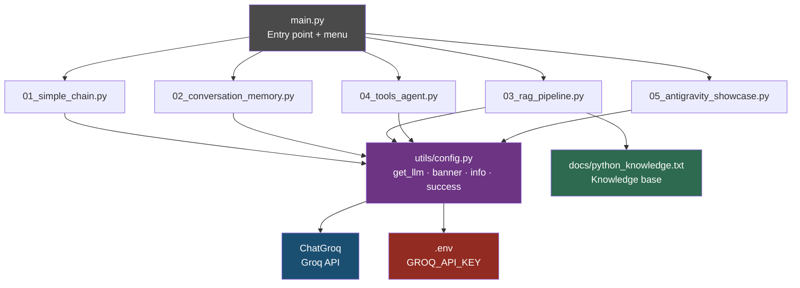

---

## Setup and Installation

### Prerequisites

- Python 3.9 or higher
- A free Groq API key from [https://console.groq.com](https://console.groq.com)

### Step 1 — Clone the repository

```bash
git clone https://github.com/snehas13/langchain-learning-hub.git
cd langchain-learning-hub
```

### Step 2 — Create and activate a virtual environment

A virtual environment isolates this project's dependencies from your
global Python installation. Always use one per project.

```bash
# Create the virtual environment
python -m venv venv
```

```bash
# Activate — Mac / Linux
source venv/bin/activate

# Activate — Windows Command Prompt
venv\Scripts\activate.bat

# Activate — Windows PowerShell
venv\Scripts\Activate.ps1
```

You will see `(venv)` at the start of your terminal prompt. That means it is active.

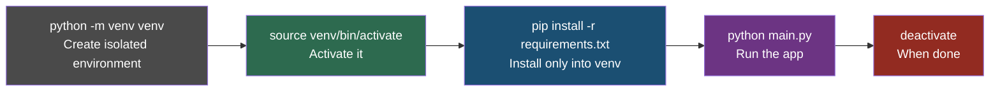

### Step 3 — Install dependencies

```bash
pip install -r requirements.txt
```

> **Note:** Use Case 3 (RAG) downloads a ~90MB HuggingFace embeddings model
> (`all-MiniLM-L6-v2`) on first run. This is free and runs locally —
> no API key needed for embeddings.

### Step 4 — Set up your API key

```bash
cp .env.example .env
```

Open `.env` and replace the placeholder:

```
GROQ_API_KEY=gsk_your_actual_key_here
```

Get a free key at [https://console.groq.com](https://console.groq.com) — no credit card required.

---

## Use Cases

### Use Case 1 — Simple Chain

**File:** `use_cases/01_simple_chain.py`
**Concepts:** `ChatPromptTemplate` · LCEL `|` pipe · `StrOutputParser` · `invoke()`

#### What it does

Builds the most fundamental LangChain pattern — a prompt template connected
to an LLM connected to an output parser using the `|` pipe operator.
Demonstrates `import antigravity` (Python's Easter egg that opens
[xkcd.com/353](https://xkcd.com/353/)) and asks the LLM to explain
its cultural significance.

#### Data Flow

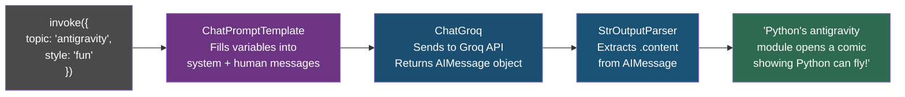

#### Code walkthrough

```python
# 1. Define prompt — {topic} and {style} are filled at runtime
prompt = ChatPromptTemplate.from_messages([
    ("system", "You are a fun Python educator."),
    ("human",  "Explain {topic} in a {style} way."),
])

# 2. Build chain — data flows left to right through the pipe
chain = prompt | llm | StrOutputParser()

# 3. Invoke — pass a dict matching your {variables}
result = chain.invoke({"topic": "antigravity", "style": "fun"})

# 4. Reuse the same chain with completely different inputs
result2 = chain.invoke({"topic": "PEP 8", "style": "formal"})
```

**Key learning:** One chain definition = infinite reuse with different inputs.
Swap the LLM in one place, the whole app updates.

---

### Use Case 2 — Conversation with Memory

**File:** `use_cases/02_conversation_memory.py`
**Concepts:** `ConversationBufferMemory` · `ConversationChain` · `MessagesPlaceholder`

#### What it does

Builds a multi-turn chatbot called PythonBot that remembers everything
said in the conversation. Demonstrates the statelessness problem and
how LangChain memory solves it.

#### The Problem Without Memory

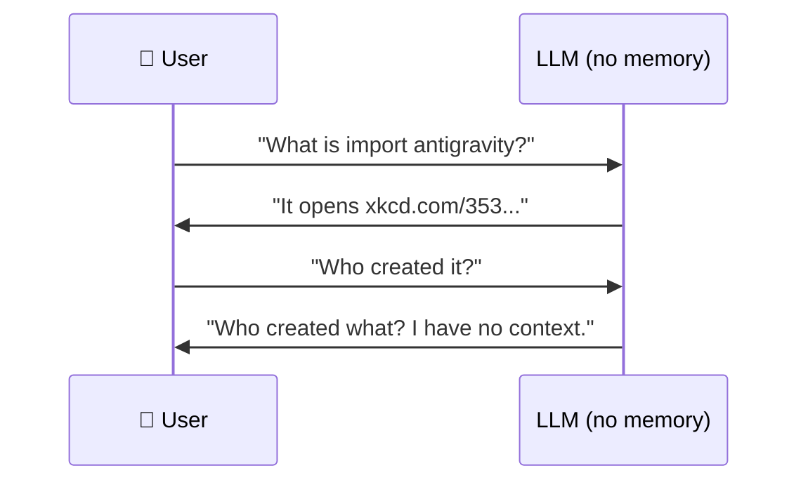

#### The Solution With Memory

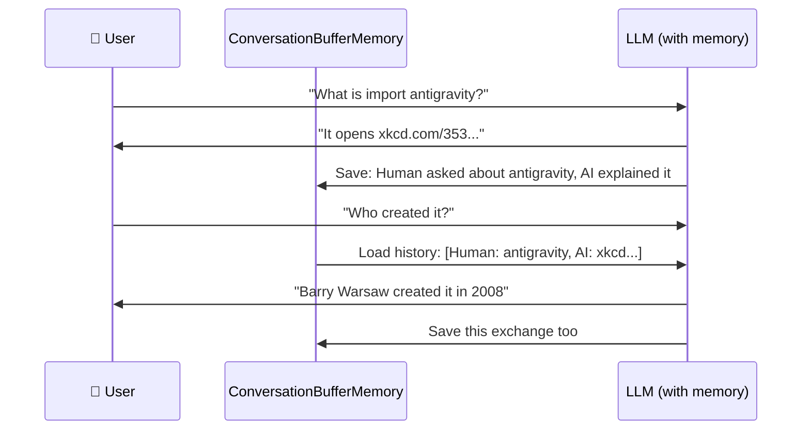

#### How MessagesPlaceholder Works

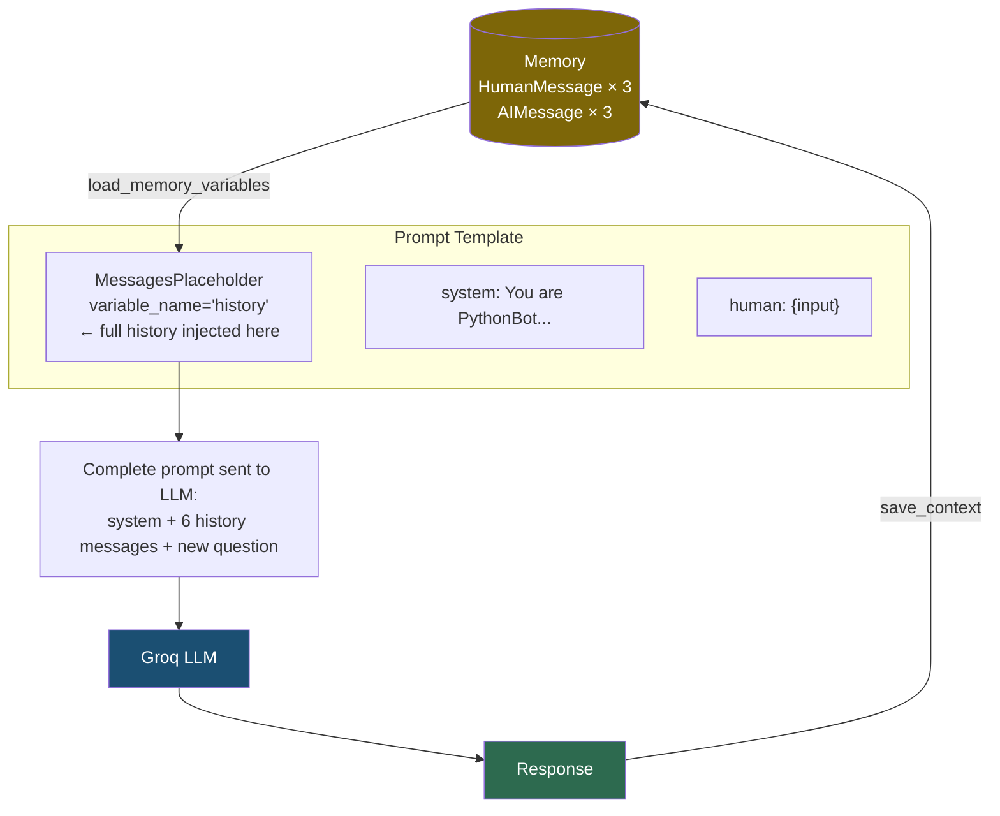

**Key learning:** `ConversationChain` automatically loads history before and
saves it after every call. You never manage the transcript manually.

---

### Use Case 3 — RAG Pipeline

**File:** `use_cases/03_rag_pipeline.py`
**Concepts:** `TextLoader` · `RecursiveCharacterTextSplitter` · `HuggingFaceEmbeddings` · `FAISS` · `RunnablePassthrough`

#### What it does

Builds a complete Retrieval Augmented Generation pipeline. Loads
`docs/python_knowledge.txt`, splits it, converts to vectors, stores
in FAISS, and answers questions using only the document — not the
LLM's training data.

#### Why RAG?

```
Without RAG:  "What is our internal refund policy?"
              → LLM: "I don't have access to your documents"

With RAG:     "What is our internal refund policy?"
              → Search your docs → find relevant paragraph
              → LLM reads paragraph → accurate answer
```

#### Full 7-Step Pipeline

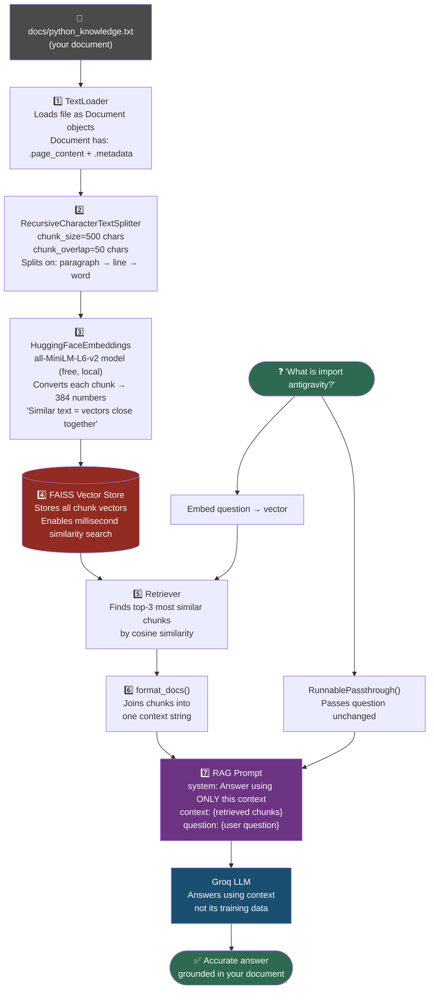

#### The RAG Chain in Code

```python
rag_chain = (
    {
        "context":  retriever | format_docs,  # question → search → top chunks
        "question": RunnablePassthrough(),    # question → prompt unchanged
    }
    | rag_prompt
    | llm
    | StrOutputParser()
)

answer = rag_chain.invoke("What is import antigravity?")
```

**Key learning:** RAG = your documents + LLM reasoning, without fine-tuning.
This pattern powers most enterprise LLM products including legal Q&A,
HR bots, internal knowledge bases, and customer support systems.

---

### Use Case 4 — Tools and Agents

**File:** `use_cases/04_tools_agent.py`
**Concepts:** `@tool` decorator · `create_react_agent` · `AgentExecutor` · ReAct loop

#### What it does

Builds a ReAct agent with 3 custom Python tools. The LLM dynamically
decides which tools to call and in what order to answer the question.

#### Chains vs Agents

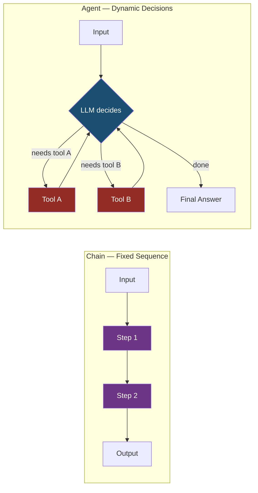

#### The 3 Custom Tools

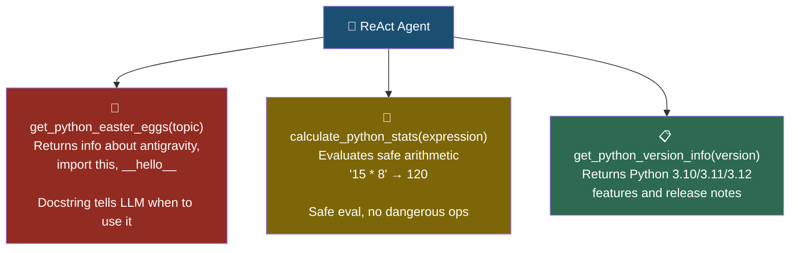

#### Full ReAct Loop

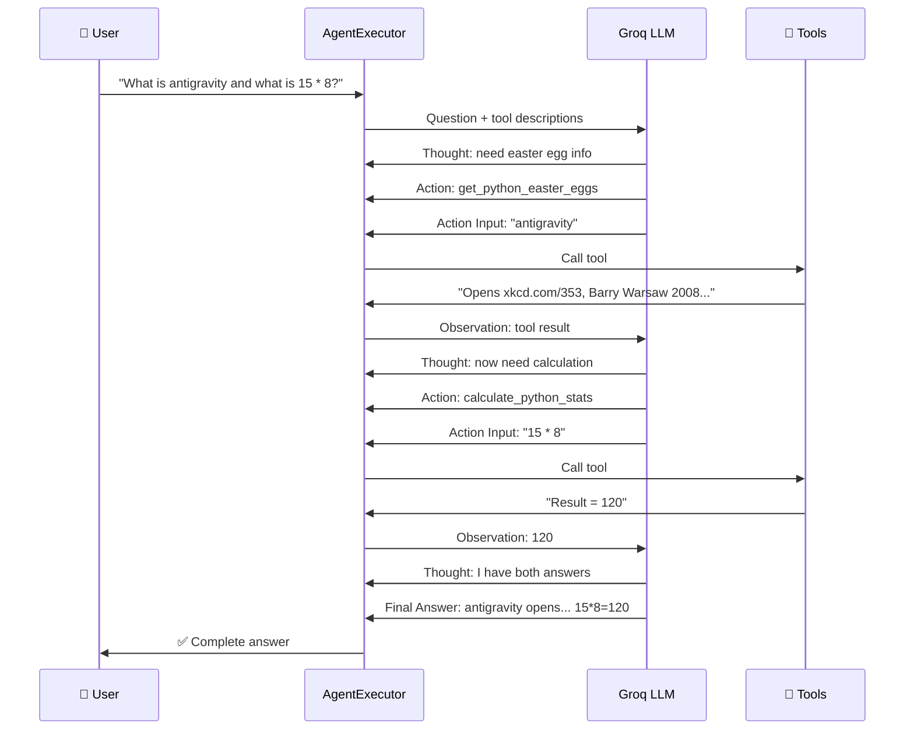

**Key learning:** Set `verbose=True` in `AgentExecutor` to see every
Thought/Action/Observation step printed in your terminal.
This is the best way to understand how agents reason.

---

### Use Case 5 — Streaming and Structured Output

**File:** `use_cases/05_antigravity_showcase.py`
**Concepts:** `.stream()` · `JsonOutputParser` · `.batch()`

#### What it does

Demonstrates three advanced LangChain output patterns using the antigravity
Easter egg as the topic: streaming tokens as they generate, forcing structured
JSON output, and processing multiple inputs in parallel.

#### Three Output Patterns

```mermaid
graph TD
    CHAIN[LCEL Chain\nprompt | llm | parser] --> INV
    CHAIN --> STR
    CHAIN --> BAT

    INV["invoke(input)\n\nWaits for full response\nReturns complete string\nUse for: simple one-off calls"]

    STR["stream(input)\n\nYields tokens one by one\nPrint as they arrive\nUse for: chatbots, real-time UI"]

    BAT["batch([input1, input2, input3])\n\nRuns all inputs in parallel\nFar faster than sequential invoke\nUse for: bulk processing"]

    style CHAIN fill:#1B4F72,color:#fff
    style INV fill:#4A4A4A,color:#fff
    style STR fill:#6C3483,color:#fff
    style BAT fill:#2D6A4F,color:#fff
```

#### Streaming — How It Works

```python
# Without streaming — user waits, then sees everything at once
result = chain.invoke({"question": "Tell me about antigravity"})
print(result)   # prints after full generation

# With streaming — user sees tokens appear immediately
for token in chain.stream({"question": "Tell me about antigravity"}):
    print(token, end="", flush=True)   # each token prints as it arrives
```

#### JsonOutputParser — Structured Data Extraction

```mermaid
graph LR
    PROMPT["System: Respond ONLY with valid JSON\nin this exact format:\n{easter_eggs: [{name, command, description}]}"] --> LLM
    LLM["Groq LLM"] --> RAW["Raw JSON string from LLM\n'{\"easter_eggs\": [{...}]}'"]
    RAW --> JOP["JsonOutputParser\nParses string → Python dict"]
    JOP --> OUT["Python dict ready to use\nresult['easter_eggs'][0]['name']"]

    style LLM fill:#1B4F72,color:#fff
    style JOP fill:#6C3483,color:#fff
    style OUT fill:#2D6A4F,color:#fff
```

**Key learning:** `.invoke()` for single calls, `.stream()` for real-time UX,
`.batch()` for throughput. All three work on any LCEL chain with zero
other changes needed.

---

## How to Run

Make sure `(venv)` appears in your terminal prompt before running.

```bash
# Show the menu
python main.py

# Run a specific use case
python main.py 1    # Simple chain
python main.py 2    # Memory chatbot
python main.py 3    # RAG pipeline
python main.py 4    # Agent with tools (set verbose=True to see reasoning)
python main.py 5    # Streaming + JSON

# Run all use cases in order
python main.py all

# Deactivate venv when done
deactivate
```

---

## Tech Stack

| Tool | Purpose | Cost |
|---|---|---|
| Python 3.9+ | Language | Free |
| LangChain | LLM framework (chains, memory, agents) | Free — open source |
| Groq | LLM inference API | Free tier available |
| Llama 3 8B | The LLM model (via Groq) | Free via Groq |
| FAISS | Vector similarity search | Free — Meta open source |
| HuggingFace `all-MiniLM-L6-v2` | Text embeddings (local) | Free — runs on CPU |
| python-dotenv | Load `.env` files safely | Free |

> **Total cost to run this project: $0**

---

## Key Learnings

After working through all 5 use cases you will understand:

| # | Concept | Taught In |
|---|---|---|
| 1 | LCEL `\|` pipe — composing chains | Use Case 1 |
| 2 | Prompt engineering — system vs human messages | Use Cases 1, 2 |
| 3 | Memory — making stateless LLMs stateful | Use Case 2 |
| 4 | RAG — LLMs + your own documents | Use Case 3 |
| 5 | Embeddings and vector search | Use Case 3 |
| 6 | Agents — LLM as a decision-maker | Use Case 4 |
| 7 | Tool design — `@tool` and docstring importance | Use Case 4 |
| 8 | Streaming — real-time token output | Use Case 5 |
| 9 | Structured output — JSON from LLMs | Use Case 5 |
| 10 | Project structure — venv, config, secrets management | All |

---

## Author

**Sneha**

[](https://github.com/snehas13)

---

## License

MIT License — free to use, modify, and distribute.
